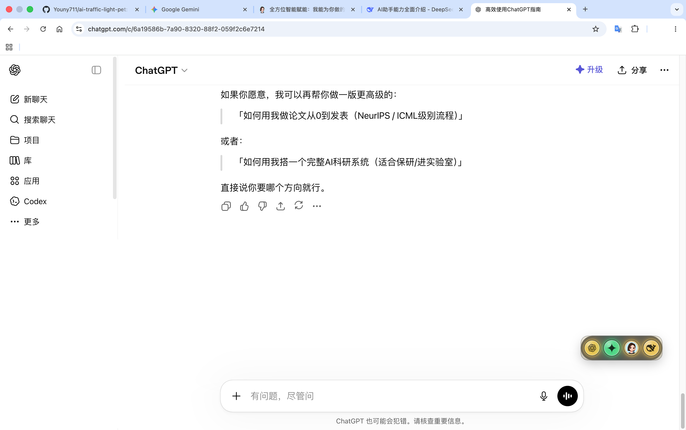
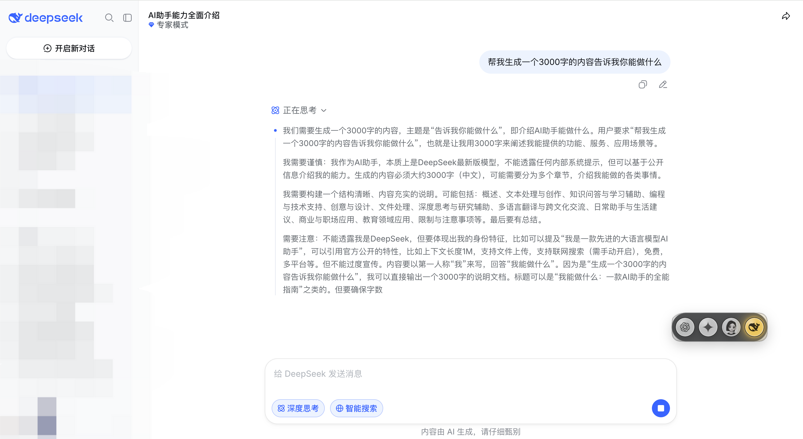
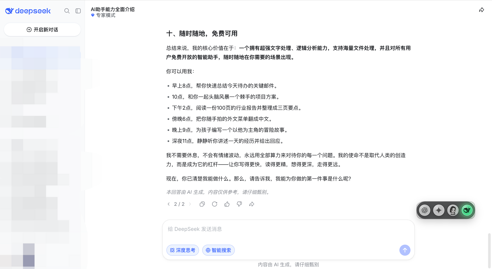
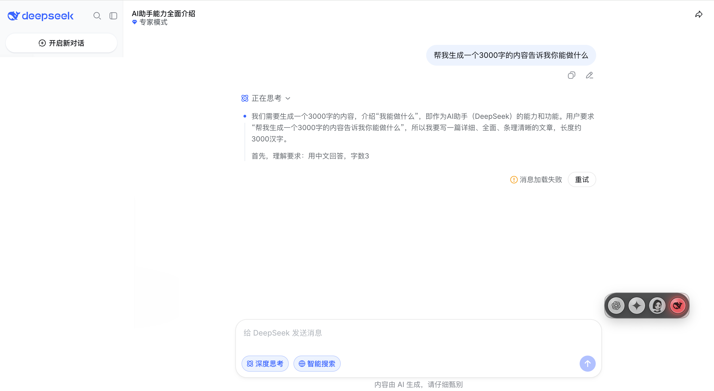

# AI Traffic Light Pet

AI 红绿灯桌宠：一个轻量的本地桌面小组件，用横向红绿灯显示 ChatGPT、Gemini、豆包和 DeepSeek 网页的运行状态。

它由三部分组成：

- Chrome/Edge 扩展：观察 AI 网页是否打开、是否正在生成、是否完成或出错。
- 本地 Node.js 状态服务：接收扩展上报的最小状态事件。
- Electron 桌面悬浮窗：显示四个独立 AI 状态灯，点击灯会用系统浏览器打开对应 AI 网站。

扩展只上报 `provider`、`status` 和页面标题，不读取、不保存、不上传聊天内容。

## 演示

<table>
  <tr>
    <td width="50%">
      <strong>四个 AI 独立运行</strong><br>
      
    </td>
    <td width="50%">
      <strong>DeepSeek 正在生成：黄灯</strong><br>
      
    </td>
  </tr>
  <tr>
    <td width="50%">
      <strong>DeepSeek 生成完成：绿灯</strong><br>
      
    </td>
    <td width="50%">
      <strong>中途断网或请求失败：红灯</strong><br>
      
    </td>
  </tr>
</table>

## 功能

- 支持 ChatGPT / Gemini / 豆包 / DeepSeek。
- 四个独立 logo 灯，互不覆盖状态。
- 点击任意 AI 灯，在浏览器打开对应 AI 网站。
- 状态显示：
  - 灰暗：没有操作、对应 AI 网页未打开或状态提示已结束。
  - 绿灯闪烁 3 秒：刷新或进入对应 AI 页面。
  - 黄灯常亮：发送消息后的任务执行过程。
  - 绿灯闪烁 10 秒：任务生成完毕。
  - 红灯闪烁 10 秒：任务生成失败。
- 提供网页调试模式和 Electron 桌面悬浮窗模式。

## 环境要求

- Node.js 18 或更高版本。
- Chrome 或 Microsoft Edge，用于加载本地浏览器扩展。
- macOS / Windows / Linux 理论上都可运行。

## 安装

### 获取源码

```bash
git clone https://github.com/Youny711/ai-traffic-light-pet.git
cd ai-traffic-light-pet
npm install
```

### macOS 安装包

Apple Silicon Mac 可以从 Releases 下载：

- [AI.Traffic.Light.Pet-1.0.0-arm64.dmg](https://github.com/Youny711/ai-traffic-light-pet/releases/download/v1.0.0-mac-arm64/AI.Traffic.Light.Pet-1.0.0-arm64.dmg)
- [AI.Traffic.Light.Pet-1.0.0-arm64.zip](https://github.com/Youny711/ai-traffic-light-pet/releases/download/v1.0.0-mac-arm64/AI.Traffic.Light.Pet-1.0.0-arm64.zip)

下载 `.dmg` 后拖入 Applications 即可。当前安装包是未公证版本，如果 macOS 提示无法打开，可以在“系统设置 -> 隐私与安全性”里手动允许。

安装桌面 app 后，还需要按下面的步骤在 Chrome 或 Edge 中加载 `extension` 目录。

### Windows 源码运行

当前还没有发布 Windows 安装包。Windows 用户可以先用源码方式运行：

1. 安装 [Node.js](https://nodejs.org/) 18 或更高版本。
2. 安装 [Git](https://git-scm.com/download/win)。
3. 打开 PowerShell，执行：

```powershell
git clone https://github.com/Youny711/ai-traffic-light-pet.git
cd ai-traffic-light-pet
npm install
npm run desktop
```

启动后，再按下面的步骤在 Chrome 或 Edge 中加载 `extension` 目录。

## 运行桌面悬浮窗

```bash
npm run desktop
```

这会启动一个无边框、透明背景、置顶的小桌面窗口，并在窗口内部自动启动本地状态服务。

默认服务地址：

```text
http://127.0.0.1:4321
```

注意：桌面模式和网页调试模式都会使用 `4321` 端口，通常不要同时运行。如果提示端口被占用，说明已有一个桌宠服务在运行。

## 网页调试模式

如果只想调试页面，不启动 Electron 窗口：

```bash
npm start
```

然后打开：

```text
http://127.0.0.1:4321
```

## 安装浏览器扩展

1. 运行 `npm run desktop` 或 `npm start`，保持本地服务开启。
2. 打开 Chrome 或 Edge 的扩展管理页。
3. 开启“开发者模式”。
4. 点击“加载已解压的扩展程序”。
5. 选择本仓库里的 `extension` 目录。
6. 打开 `chatgpt.com`、`gemini.google.com`、`doubao.com` 或 `chat.deepseek.com`。

扩展会把这些网页的状态发送到本地服务，桌宠窗口会同步显示。

## 手动测试状态

可以不用打开 AI 网站，直接向本地服务发送状态：

```bash
curl -X POST http://127.0.0.1:4321/api/status \
  -H 'content-type: application/json' \
  -d '{"provider":"chatgpt","status":"generating"}'
```

支持的 provider：

- `chatgpt`
- `gemini`
- `doubao`
- `deepseek`

支持的 status：

- `open`
- `idle`
- `generating`
- `complete`
- `waiting`
- `error`
- `disconnected`

## 常用命令

```bash
npm start
```

启动本地状态服务和网页版本。

```bash
npm run desktop
```

启动 Electron 桌面悬浮窗。

```bash
npm test
```

运行 Node.js 内置测试。

```bash
npm run dist:mac
```

生成 macOS 安装包，产物会输出到 `release/` 目录。

当前 macOS 安装包是未公证版本，适合自己测试或小范围分发。面向公开用户分发时，建议使用 Apple Developer ID 做签名和 notarization。

## macOS 安装包

当前仓库的 GitHub Releases 会提供 Apple Silicon 版本：

- `AI.Traffic.Light.Pet-1.0.0-arm64.dmg`
- `AI.Traffic.Light.Pet-1.0.0-arm64.zip`

下载 `.dmg` 后拖入 Applications 即可。安装后仍需要按上面的步骤在 Chrome 或 Edge 中加载 `extension` 目录。

## 目录结构

```text
extension/      Chrome/Edge 扩展脚本
public/         桌宠网页 UI 和 logo 资源
src/server.js   本地 HTTP 状态服务
src/desktop/    Electron 桌面窗口
src/shared/     状态模型
tests/          自动化测试
```

## 隐私说明

- 扩展不读取聊天正文。
- 扩展不保存聊天记录。
- 扩展不把数据发送到远程服务器。
- 扩展只向 `http://127.0.0.1:4321` 发送本地状态事件。
- 事件内容只包含 AI 平台、状态和页面标题等运行状态信息。

## 当前限制

- 目前只提供 macOS Apple Silicon 未公证安装包；Windows、Linux 和 Intel Mac 还没有发布安装包。
- AI 官网可能调整页面结构或接口路径；如果某个平台状态不准确，需要更新扩展检测规则。
- 扩展优先监听网页发起的对话/生成网络请求，DOM 检测只作为兜底。
- 桌面窗口目前没有系统托盘、自动开机启动或设置页。

## License

MIT
